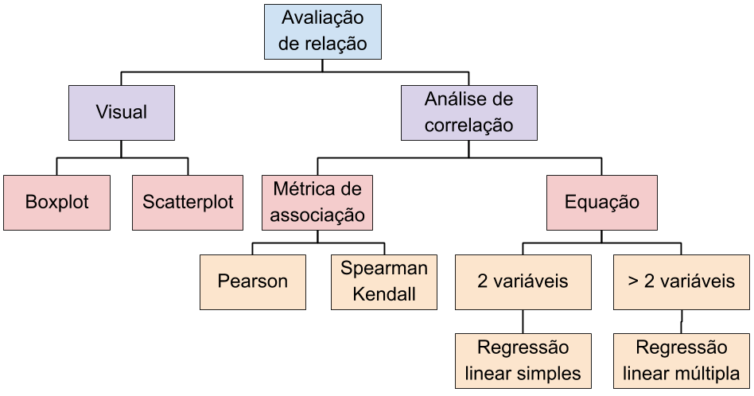

```{r setup, include=FALSE}
knitr::opts_chunk$set(echo = FALSE)

library(tidyverse)
library(GGally)

theme_set(theme_bw(base_size = 14))
```

## Análise de Correlação

* Relação ou associação entre variáveis numéricas

&nbsp;

* Exemplo:
  + Campanha de marketing
  + Recebimento de folhetos e unidades efetivamente compradas
  
## Exemplo fictício: anuncios vs compras

```{r, echo=TRUE, fig.height=4, fig.align='center'}
anuncios <- c(5,4,4,6,8,5,10,14)
compras <- c(8,9,10,13,15,16,22,20)
plot(anuncios, compras)
```

## Características de relações

* *Formato* da relação
  + linear, exponencial, parabólica, linear e depois assintótica, etc

&nbsp;

* *Força* da relação
  + correlação forte, fraca ou sem correlação

&nbsp;

* *Sinal* da relação (quando é percebida)
  + positiva ou negativa

&nbsp;
  
* *Pontos extremos* fora da relação

## Objetivos

* Coeficiente de correlação
  + **Medir** a relação **linear** entre duas variáveis
    + Força e sinal
  + Tempo de processamento está relacionado ao tamanho da entrada?
  
&nbsp;

* Análise de regressão
  + Equação linear para **estimar** o valor de uma variável
  + Qual a relação entre o tamanho da entrada e o tempo de processamento?

## Técnicas para avaliar relações lineares

<p align="center">
  
</p>

## Como relacionar varáveis numéricas?

* Gráfico de dispersão (scatterplot)
  + Técnica básica para verificar relação
  
&nbsp;

* Análise de correção
  + Para relações lineares
  
## Força e Sinal: coeficiente linear


<p align="center">
  
</p>

<footnote>da wikipedia</footnote>

## Formato

* Relação linear:  $y = f(x) = b_0x + b_1$

```{r, echo=TRUE}
set.seed(123)

erro <- 50

x <- rnorm(100) * 100
y <- 0.5 * x + rnorm(100) * erro + 20

dados <- tibble(x, y)
```

## Formato
```{r, echo=FALSE, fig.height=4, fig.align='center'}
dados %>%  ggplot(aes(x, y)) + geom_point(alpha = 0.5, size = 4)
```

```{r, echo=TRUE}
cor(dados$x, dados$y, method = "pearson")
```

## Formato

* Dobro de erro em torno de uma função linear $f(x)$

```{r, echo=TRUE}
erro <- 50 * 2

x <- rnorm(100) * 100
y <- 0.5 * x + rnorm(100) * erro + 20

dados_2x_erro <- tibble(x, y)
```

## Formato
```{r, echo=FALSE, fig.height=4, fig.align='center'}
dados_2x_erro %>%  ggplot(aes(x, y)) + geom_point(alpha = 0.5, size = 4)
```

```{r, echo=TRUE}
cor(dados_2x_erro$x, dados_2x_erro$y, method = "pearson")
```

## Outros coeficientes

```{r, echo=TRUE}
dados %>% summarise(pearson = cor(x, y, method = "pearson"),
                    spearman = cor(x, y, method = "spearman"),
                    kendall = cor(x, y, method = "kendall"))

dados_2x_erro %>% summarise(pearson = cor(x, y, method = "pearson"),
                    spearman = cor(x, y, method = "spearman"),
                    kendall = cor(x, y, method = "kendall"))
```

## Linear?

```{r, echo=FALSE, fig.align='center', fig.width=10}
dados <- data.frame(coef = paste("R =", c(1, 1, -1, -1, 0, 0)), x = c(0, 1, 0, 1, 0, 1), y = c(0, 1, 1, 0, 0.5, 0.5))
dados %>% ggplot(aes(x, y)) + 
  geom_line(size = 1, color = "darkblue") + 
  facet_grid(~ coef) + 
  theme_bw(base_size = 18) + 
  theme(axis.text.x = element_blank(),
        axis.text.y = element_blank(),
        axis.ticks = element_blank()) + 
  xlab(NULL) + ylab(NULL)
  
```

## Coeficiente de correlação

* Indica a força e direção da correlação linear entre variáveis

&nbsp;

* Varia de $-1$ a $+1$
  + Próximo de $+1$: quando X **aumenta**, Y **aumenta** linearmente
  + Próximo de $-1$: quando X **aumenta**, Y **diminui** linearmente
  + Igual a $0$: não há relação

## Coeficiente de Pearson ($r$)

* Coeficiente de correlação linear amostral 
  + As variáveis devem seguir um distribuição normal
  + Pouco resistente a outliers
  
&nbsp;

* Força:
  + $\pm 0.7$ a $\pm 1$: relação forte
  + $\pm 0.3$ a $\pm 0.7$: relação moderada
  + $\pm 0$ a $\pm 0.3$: relação fraca
  + $0$: nada se pode afirmar 

## Coeficientes robustos

* Funcionam mesmo que os dados não sejam normais
  + Spearman
  + Kendall
  
## Correlação de Spearman ($\rho$)

* Indica a força e direção da conrrelação baseda em ranking

* Não exige que a relação seja linear

* Mais restente a outliers 

&nbsp;

* Força:
  + $\pm 0.9$ a $\pm 1$: relação muito forte
  + $\pm 0.7$ a $\pm 0.9$: relação forte
  + $\pm 0.5$ a $\pm 0.7$: relação moderada

## Correlação de Kendall ($\tau$)

* Funciona baseado em pares concordantes e discordantes

* Resistente a outliers (+ que Spearman)

* Para pequenos conjuntos de dados não-normais, com grande número de concordância

&nbsp;

* Força:
  + $\pm 0.9$ a $\pm 1$: relação muito forte
  + $\pm 0.7$ a $\pm 0.9$: relação forte
  + $\pm 0.5$ a $\pm 0.7$: relação moderada

## Relação não linear

```{r, fig.align='center'}
dff <- tibble(x = runif(100, min = 1, max = 20)) %>% mutate(y = 100 * exp(-1.2 * x))
```

```{r, fig.align='center', echo=TRUE}
ggplot(dff, aes(x, y)) + geom_point(alpha = 0.5, size = 4)
```

## Escala de log

```{r, fig.align='center', echo=TRUE}
ggplot(dff, aes(x, y)) + geom_point(alpha = 0.5, size = 4) + scale_y_log10()
```

## Coeficientes de correlação da relação 

```{r, echo=TRUE}
dff %>% summarise(pearson = cor(x, y, method = "pearson"), 
                  spearman = cor(x, y, method = "spearman"), 
                  kendall = cor(x, y, method = "kendall"))
```

## Qual coeficiente usar?

* Coeficientes robustos: Spearman e Kendall
  + Funcionam bem com valores atípicos
  + Funcionam bem com relações não lineares
  + Funcionam bem mesmo com valores extremos (muito altos ou muito baixos)
  
&nbsp;
  
* Como dados normais e uma relação que parece linear
  + Usar Pearson

## Correlaçoes e causalidade

* Correlação é uma medida que indica relação entre 2 variáveis
  + Podem indicar uma relação preditiva que pode ser explorada na prática
  
&nbsp;

* Correlação não indica causa!
  + Correlações espúrias 
  
## Transformações e correlação

* Relações lineares são melhores para trabalhar
  + São mais fáceis de visualizar, interpretar e por vezes quantificar
  + Transformações em escalas podem ajudar na análse de relações não lineares
  
&nbsp;

* Se $y$ cresce de forma logarítmica em função de $x$
  + $y = log(x)$
  + Relação linear entre $y$ e $log(x)$
 

## Com escalas lineares

```{r, fig.align='center', fig.height=5}
mundo = gapminder::gapminder %>% 
  group_by(country, continent) %>% 
  arrange(-year) %>% 
  slice(1) 

mundo %>% 
  filter(continent %in% c("Americas", "Europe")) %>% 
  ggplot(aes(x = gdpPercap, y = lifeExp, color = continent)) + 
  geom_point(size = 3) 
```

## Com x em escala de log  $y = f(log(x))$

```{r, fig.align='center', fig.height=5}
mundo %>% 
  filter(continent %in% c("Americas", "Europe")) %>% 
  ggplot(aes(x = gdpPercap, y = lifeExp, color = continent)) + 
  geom_point(size = 3) + 
  scale_x_log10() 
```

## Funções exponenciais

* Se $y$ cresce exponencialmente com $x$
  + $y = ae^{bx} \implies ln(y) = ln(a) + bx$
  + **scale_y_log10** gera visualização linear da relação
  + Relação linear entre $ln(y)$ e $x$

&nbsp;

* Se $y = ax^b \implies ln(y) = ln(a) + blog(x)$ 
  + Relaçaõ linear entre $ln(y)$ e $log(x)$
  
## Escala linear - linear

```{r}
df = MASS::Animals
```

```{r, fig.align='center', fig.height=5, echo=TRUE}
ggplot(df, aes(body, brain)) + geom_point(size = 4)
```

## Escala log - linear

```{r, fig.align='center', fig.height=5, echo=TRUE}
ggplot(df, aes(body, brain)) + geom_point(size = 4) + scale_x_log10()
```

## Escala linear - log

```{r, fig.align='center', fig.height=5, echo=TRUE}
ggplot(df, aes(body, brain)) + geom_point(size = 4) + scale_y_log10()
```

## Escala log - log: relação polinomial entre x e y
```{r, fig.align='center', fig.height=5, echo=TRUE}
ggplot(df, aes(body, brain)) + geom_point(size = 4) + scale_x_log10() + scale_y_log10()
```

## Várias variáveis: matriz de dispersão (ggpairs)

```{r, fig.align='center', message=FALSE, fig.height=5.8, fig.width=10.5}
ggpairs(iris, progress = F)
```

## Sumário vs. Todos os pontos

* É sempre bom usar apenas um valor para representar a relação?
  + Coeficiente de correlação

&nbsp;

* Os gráficos de dispersão são o primeiro nível
  + O coeficiente serve de complementação e quantificação da análise
  
&nbsp;

* Nem sempre o coeficiente é últil
  + Exemplo: o [quarteto de Anscombe](https://en.wikipedia.org/wiki/Anscombe%27s_quartet)
  
## Média e desvio padrão são praticamente iguais

```{r}
anscombe %>% summarise_all(list(media = mean, desvio = sd)) %>% gather("metrica", "valor") %>% 
  mutate(var = substr(metrica, 1, 2),
         metrica = substr(metrica, 4, 9)) %>% select(var, metrica, valor)
```

## Correlação entre xs e ys

```{r}
xs = anscombe %>% 
  select(1:4) %>% 
  gather(key = "v1", value = "value1")

ys = anscombe %>% 
  select(5:8) %>% 
  gather(key = "v2", value = "value2")

dados = bind_cols(xs, ys) %>% 
  mutate(vars = str_glue("{v1} e {v2}"))

dados %>% 
  group_by(vars) %>% 
  summarise(correlacao = cor(value1, value2, method = "pearson")) %>% data.frame()
```

## E se olharmos os dados?

```{r, fig.align='center', fig.width=9, fig.height=5.5}
ggplot(dados, aes(value1, value2)) + 
  geom_point(color = "darkorange", size = 4, alpha = 0.7) + 
  scale_x_continuous(breaks = seq(0, 20, 2)) + 
  scale_y_continuous(breaks = seq(0, 12, 2)) + 
  expand_limits(x = 0, y = 0) + 
  facet_wrap(~ vars) + xlab(NULL) + ylab(NULL)
```

## Quatro relações diferentes, mesma quantificação

* No grupo 2, não há uma relação linear

&nbsp;

* No 3º, há uma relação perfeita entre a maioria das observações
  + Com uma exceção

&nbsp;

* No 4º, há uma exceção que faz parecer que há uma relação

## O que os outros coeficientes dizem?

```{r}
dados %>% 
  group_by(vars) %>% 
  summarise(pearson = cor(value1, value2, method = "pearson"), 
            spearman = cor(value1, value2, method = "spearman"),
            kendall = cor(value1, value2, method = "kendall"))
```


