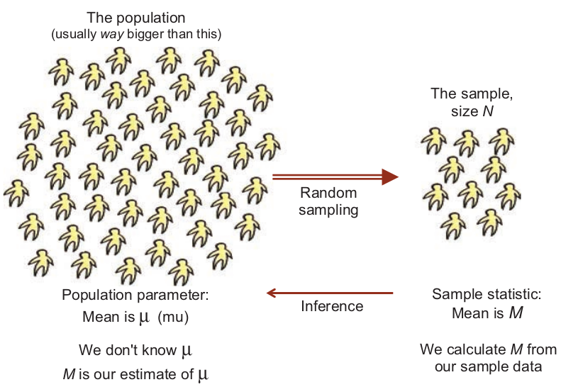
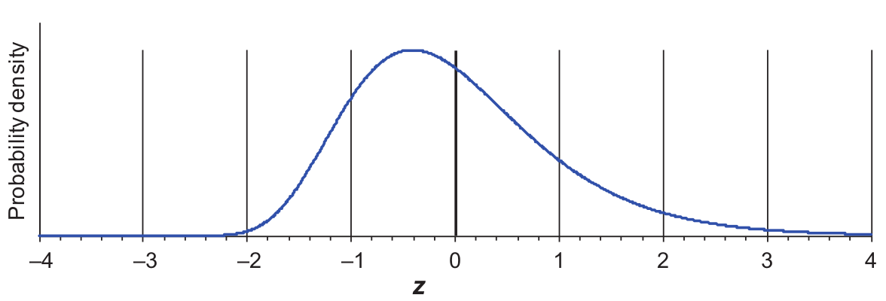
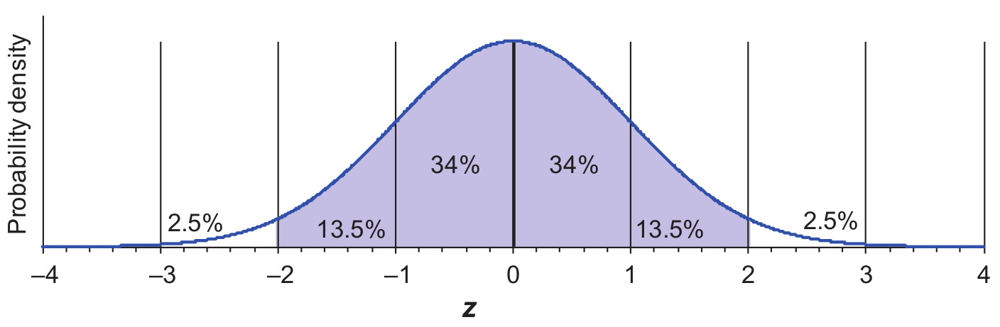
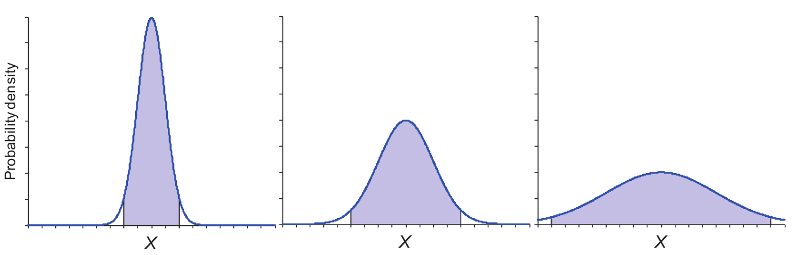
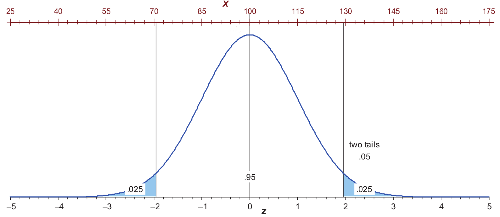
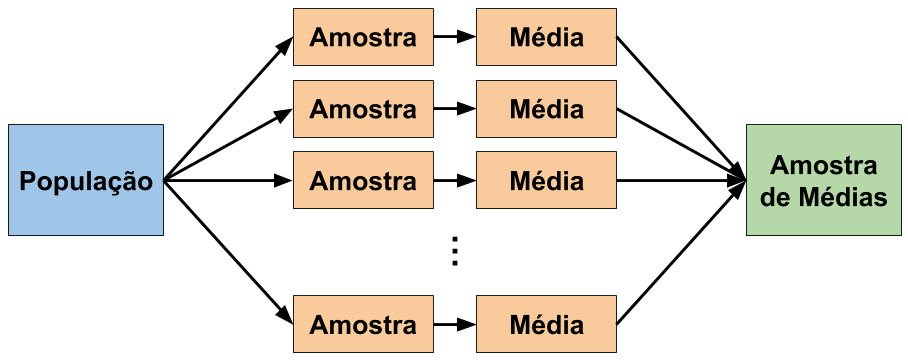

```{r setup, include=FALSE}
knitr::opts_chunk$set(echo = FALSE)

library(readr)
library(here)
library(dplyr)
library(ggplot2)
library(scales)

fpcc2 <- read_csv(here("data/dados-fpcc2.csv"))
```

## Estatística descritiva

* Análise exploratória dos dados (EDA)
  + Extrair informação dos dados 
  + Conhecer os dados que serão usados

&nbsp;

* Exemplo:
  + “Programadores desta equipe conseguem corrigir 2,5 bugs por dia”  


## Estatística inferencial

* Tirar conclusões sobre a população a partir de amostras
  + Inferir características de uma população
    + Considerando uma amostra representativa da população
    + Calculando estatísticas a partir da amostra

&nbsp;

* Exemplo
  + “Programadores Java conseguem corrigir 1,3 bugs por dia” 
  + Foram entrevistados 1200 programadores em 25 países

## Processo de inferência 

<p align="center">
  
</p>

## Amostras aleatórias

* Amostras representativas da população
  + Seleção aleatória de elementos
  + Igual probabilidade de seleção dos elementos da população
  + Os elementos são selecionados de forma independente
  
&nbsp;
  
* Um conjunto de dados representativo sobre a população
  + Por exemplo: idades de um conjunto aleatório de alunos
  
&nbsp;

* Dados são usados para calcular métricas sobre a amostra
  + Por exemplo: a frequência relativa de idades dos alunos

## Variáveis aleatórias

* Uma variável quantitativa, cujo resultado (valor) depende de fatores aleatórios
  + Métricas calculadas a partir de uma amostra aleatória
  
&nbsp;

* Formalmente é uma função definida sobre o espaço amostral
  + Atribui um valor real a cada elemento do espaço amostral
  + Por exemplo: a frequência relativa de idades dos alunos da amostra
  
&nbsp;

* Variáveis aleatórias podem ser discretas ou contínuas

## Variáveis aleatórias

* **Variáveis discretas** assumem valores contidos em um conjunto finito e numerável
  + Exemplos: 
    + Contagem de idades de alunos em uma amostra
    + Número de pull-requests em uma amostra de repositórios
    
&nbsp;

* **Variáveis contínuas** assumem valores que abragem todo um intervalo de números reais
  + Exemplos: 
    + Frequência relativa de idades de alunos em uma amostra
    + Tempo de resposta de um sistema computacional
  

## Estivativa de probabilidade

* Frequência relativa é uma estimativa de probabilidade para a população

```{r, fig.align='center', fig.width=10}
fpcc2 %>% mutate(total = n()) %>% group_by(Idade) %>%
  summarise(valor = n()/first(total)) %>% 
  ggplot(aes(Idade, valor)) +
  geom_bar(stat = "identity") + 
  theme_bw(base_size = 18) + 
  scale_y_continuous(labels = percent) + 
  scale_x_continuous(breaks = seq(20,40)) + 
  ylab("")
```

## Distribuição de probabilidade

* O comportamento de uma variável aleatória é descrito por uma distribuição de probabilidade
  + Variáveis aleatórias seguem uma distribuição (discreta ou contínua)

&nbsp;

* Estatísticas da distribuição da amostra permitem a realização de inferências
  + Generalizar características da amostra para a população
  + Considerando estatísticas de distribuições de probabilidades conhecidas
    + Exemplo: média e desvio padrão


## Distribuições contínuas

* Distribuição de probabilidade de uma variável aleatória contínua
  + Áreas abaixo da curva correspondem a probabilidades 
  + A área total abaixo da curva é igual a 1
  + Exemplo: valores entre -1 e 0 possuem maior probabilidade de ocorrer
  
*Exemplo de distribuição*:

<p align="center">
  
</p>

## Distribuições contínuas

* O gráfico descreve uma função de distribuilção acumulada (FDA)
  + Gráfico de densidade de probabilidade (eixo y)
  + O eixo y representa o acúmulo da probabilidade ao longo do exio x
    + $F(x) = P(X \leq x)$

*Exemplo de distribuição*:

<p align="center">
  
</p>

## Distribuição normal

* Uma distribuição contínua bastante importante na estatística
  + É comum assumir que a população é normalmente distribuída
    + Amostra selecionada aleatoriamente de uma distribuição normal  
    
  + Diversos modelos e testes estatísticos baseiam-se na normal  
  
&nbsp;

* É possível construir a curva de uma normal a partir de dois parâmetros:
  + Média ($\mu$) 
  + Desvio padrão ($\sigma$)

## Exemplo de distribuição normal  
  
* Distribuição normal $X$ com $\mu = 100$ (média) e $\sigma = 15$ (desvio padrão) 

```{r, echo=TRUE}
dist_normal <- rnorm(n = 10000, mean = 100, sd = 15)
```

```{r, fig.align='center', fig.height=4.5, fig.width=9.5}
dff <- data.frame(values = rnorm(n = 10000, mean = 100, sd = 15))
bw = 2
n_obs = sum(!is.na(dff$values))

dff %>% ggplot(aes(values)) + 
  geom_histogram(binwidth = bw, alpha = 0.5) + 
  stat_function(fun = function(x) 
    dnorm(x, mean = mean(dff$values), sd = sd(dff$values)) * bw * n_obs) + 
  theme_bw(base_size = 18) +
  scale_x_continuous(breaks = seq(25, 175, 15), limits = c(25, 175)) + 
  ylab("") + xlab("")
```

## Distribuição normal padrão

* Distribuição normal com média igual a 0 e desvio padrão igual a 1
  + Geralmente representada em termos de *z-scores*, que corresponde a distância da média em unidades de desvio padrão
$$z = \frac{X - \mu}{\sigma}$$
  
* Qualquer distribuição normal pode ser convertida de/para normal padrão
  + Exemplo: uma população normalmente distribuída $X$ com $\mu = 100$ e $\sigma = 15$, qual a probabilidade de $X > 130$?
$$P(X > 130) = P(z > 2) = 0.0228 = 2.28\%$$

## z-scores, probabilidades e áreas
  
* A normal é simétrica e as áreas são as mesmas abaixo e acima da média
* As proporções entre $z$ e as áreas (probabilidades) são mantidas
  + $34\%$ dos valores entre $-1$ e a média e outros $34\%$ entre a média e $1$
  + Cerca de $95\%$ dos valores estão entre os 2 desvios da média 
  
<p align="center">
  
</p>

## Três distribuições normais

* A mesma relação entre $z$ e área (ou probabilidade)
  + Calculadas com base na mesma média ($\mu$)
  + Diferem em termos do desvio padrão ($\sigma$)

<p align="center">
  
</p>

## Distribuição normal X e normal padrão z

* Mesmo formato de distribuição em diferentes escalas
  + As linhas verticais estão em $z = \pm1.96$ com duas caudas (somando $5\%$)
  + O restante da área soma $95\%$ de probabilidade

<p align="center">
  
</p>

## Questões importantes sobre a normal

* O que há de importante:

  + Na construção de uma normal a partir de dois parâmetros: $\mu$ e $\sigma$? 
  
  + Na mesma relação entre $z$ e área para diferentes normais?  
  
  + Em $z = \pm1.96$ e caudas somando $5\%$ de probabilidade?  
  
  + Na área central da normal representando $95\%$ de probabilidade?


## Distribuição amostral de médias de amostras

* Distribuição criada pelas médias de várias amostras
  + Considere a seleção amostras independentes de uma população
  + A amostra final é formada pelas médias das amostras da população

&nbsp;

<p align="center">
  
</p>

## Distribuição amostral de médias e a normal 

* Uma distribuição amostral de médias tem o formato da normal
  + Para uma quantidade grande de amostas da população (médias)

&nbsp;

&nbsp;

<center>
<font size="6pt">
**Por que a distribuição amostral de médias é<br> semelhante a normal?**
</font>
</center>

## Teorema do Limite Central

&nbsp;

<center>
<font size="6pt">
A distribuição amostral da média, ou da soma, de um número de variáveis independentes é aproximadamente normal 
</font>
</center>

&nbsp;

&nbsp;

* Independente da distribuição das variáveis da população

* Tamanhos de amostra ($N$) maiores aproximam a distribuição da normal  

## Erro padrão (SE)

* O erro padrão $SE$ é o desvio padrão de uma distribuição de médias
  + Depende do tamanho da amostra de médias $N$
  
$$SE = \frac{\sigma}{\sqrt{N}}$$


* $SE$ descreve o quão distante da média da população está a média da distribuição de médias (informalmente) 

* Então, a distribuição amostral de médias é **normalmente distribuída** com:
  + Média $\mu$
  + Desvio padrão $SE = \sigma / \sqrt{N}$

## O tabuleiro de Galton (quincunx)

<center>
Dados influenciados por efeitos aleatórios e independentes tendem a ser **normalmente
distribuídos**  
</center>  
<br>
<br>
<p align="center">
  
</p>